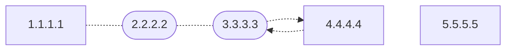

# CS168 Traceroute Project Spec
> The Internet is a large and complex aggregation of network hardware, connected together by gateways. 	Tracking the route one's packets follow (or finding the miscreant gateway that's discarding your packets) can be difficult. **traceroute** utilizes the IP protocol `time to live` field and attempts to elicit an ICMP TIME_EXCEEDED response from each gateway along the path to some host.
-- [Traceroute Man Page](https://man.freebsd.org/cgi/man.cgi?query=traceroute)

## Background
Traceroute is a popular debugging tool that was first developed early in the history of the Internet. It allows users to get a general sense of the path packets take through the network en route to a destination.
To understand how traceroute works, first consider the `Time to Live` (TTL) field defined in the [IP Header](https://datatracker.ietf.org/doc/html/rfc791#section-3.1). The IP TTL ensures that packets do not loop indefinitely through misconfigured Internet topologies by setting an upper bound on the number of hops an IP packet can traverse. Its implementation is simple: The originator of an IP packet sets an initial TTL value to something generally above 30. Each router that receives the packet checks if `TTL=1`. If it is, the router generates an ICMP Time Exceeded message (see [RFC 792](https://datatracker.ietf.org/doc/html/rfc792)) and sends it back to the source of the packet. Otherwise, the TTL is decremented, and the packet is forwarded to the next router.

Traceroute exploits the behavior of the IP TTL header to determine the path packets take en route to a particular destination. It does this by sending a series of probes (usually UDP packets) with incrementing TTLs. Traceroute sets the TTL of the first probe to 1. The first router in the path that receives the probe will drop it and send an ICMP Time Exceeded message back to traceroute. This Time Exceeded message has the router's IP as its source, thus revealing the router's IP to traceroute. Traceroute repeats this process, incrementing the TTL of its probes by one each time until it reveals all routers in the path.
### Example

*If the above diagram fails to render, try viewing on Github or in VS Code*

Suppose we have the above network topology and that `1.1.1.1` is the local host on which we'll run traceroute. `4.4.4.4` is the final destination host that we are searching for. `2.2.2.2` and `3.3.3.3` are routers that sit in between `1.1.1.1` and `4.4.4.4`.

If on `1.1.1.1` we open up a terminal and run `traceroute 4.4.4.4`, the following steps will happen:
- `1.1.1.1` will send a UDP packet with an IPv4 header of `IP(TTL=1, src=1.1.1.1, dst=4.4.4.4)`
- `2.2.2.2` will receive this UDP packet and notice the `TTL=1`.
- Since the TTL is one, `2.2.2.2` will drop the packet and send an ICMP Time Exceeded message back to the sender. This Time Exceeded message will have an IPv4 header of `IP(src=2.2.2.2, dst=1.1.1.1)`.
- `1.1.1.1` receives this Time Exceeded message, inspects the source IP, and learns that the first hop on the way to `4.4.4.4` is `2.2.2.2`. It prints this information to the console.
- Next, `1.1.1.1` generates a UDP packet with an IPv4 header of `IP(TTL=2, src=1.1.1.1, dst=4.4.4.4)`.
- `2.2.2.2` receives this packet and decrements the TTL, givings us an IPv4 header of `IP(TTL=1, src=1.1.1.1, dst=4.4.4.4)`. `2.2.2.2` passes this packet to `3.3.3.3`.
- `3.3.3.3` Again, the TTL is one, so it generates an ICMP Time Exceeded message with an IPv4 header of `IP(src=3.3.3.3, dst=1.1.1.1)`. It sends this packet back to `1.1.1.1`
- The packet goes through `2.2.2.2` before making its way to `1.1.1.1`. Once received, `1.1.1.1` knows that the second hop on the path is `3.3.3.3` from the source IP of the time exceeded message.
- `2.2.2.2` receives this packet, decrements the TTL to 2, and forwards to `3.3.3.3`.
- Finally, `1.1.1.1` sends a UDP packet with `IP(TTL=3, src=1.1.1.1, dst=4.4.4.4).
- `3.3.3.3` receives the packet, decrements the TTL to 1, and forwards to `4.4.4.4`.
- `4.4.4.4` receives the packet and notices that the packet is destined for itself. `4.4.4.4` will check if it has any processes listening for UDP on the destination port in the packet. Most of the time, there won't be, so `4.4.4.4` will generate an ICMP Port Unreachable with `IP(src=4.4.4.4, dst=1.1.1.1)` and send that packet back to `1.1.1.1`. Note, the exact behavior of this step is highly variable depending on the configuration of `4.4.4.4`.
- Finally, this Port Unreachable message will make its way back to `1.1.1.1`. Since this packet has a source IP of `4.4.4.4`, `1.1.1.1` knows that it's reached its intended end host and it finishes.

The above is just an example, there are quite a few traceroute implementations written at different times for different operating systems with different goals. These can have different approaches with differing levels of complexity. You can think of the above walkthrough as the simplest approach described with the goal of being illustrative.
## Project Description
Your goal is to implement traceroute in Python. You will do this by implementing the various `TODO`'s in `traceroute.py`.

The project is designed to run correctly against the internet in addition to the autograder. You are encouraged to try this out, both for debugging purposes, and for fun.

This project does not require a great deal of code to complete. Instead, the project is largely designed to test your ability to independently research and apply the necessary information given a certain degree of ambiguity. As a result, you are highly encouraged to carefully read the spec and starter code before you begin working. While it may feel slow, we can assure you that doing so will ultimately save you a great deal of time.

Note that this is a new project for Spring of 2024. There will be bugs, confusing wording, typos, errors in the spec, etc. If you notice any issues, please report them. Additionally, be aware that we reserve the right to change the autograder tests at any time for any reason. Your code will be scored against the autograder tests on the due date.
### Dos and Don'ts
- Try to get your code running on the command line before submitting it to the autograder. While not strictly required, the iteration loop is much faster for finding and resolving problems.
- All of your code must live in `traceroute.py`. If you have any other files, they will not be copied to autograder, and your code will be tested without them.
- Do not modify util.py. Any modifications you make will not be copied to the autograder.
- Python 3.11 or newer is recommended.
- You may not use python packages not included in the standard library.
- We recommend you lint your code and run it through a static checker like `mypy`. Run `make lint` to perform our recommended lints.
- TAs are here to help with conceptual understanding of the underlying networking concepts. TAs will not help with general programming questions, debug student code, or guide students to the solution of specific tests.
- **AI** You may not use AI tools (such as ChatGPT, GitHub Copilot, etc.). You **may not** use them to better understand how traceroute works, how to approach the problem, generate examples, assist with coding, or for any other reason related to the project.
- Don't stress about getting a perfect score on this project. While everyone should be able to pass the majority of the tests, there are a few tests that are intentionally very difficult to pass. Most students will not get 100%.
- See discussion below on dos and don'ts for professional traceroute implementations.
### Restricted Imports
While not required, there are some standard library modules that simplify aspects of the project. You are encouraged to review the standard library to see what's available.

Some imports are restricted as they present a security risk to the autograder and are not relevant to the project. These include imports that allow for code introspection, file system access, network access etc. The import blocker is implemented as a whitelist, and as a result it is entirely possible that we accidentally blocked something that may be useful and should be allowed. If there's a restricted import you would find useful, contact the staff and we can consider whitelisting it.

Finally, note that while the socket API has a bunch of very useful functions for implementing this project, we ultimately had to restrict it due to autograder security concerns. We made an effort to make all of the possibly useful functions available in `util.py`. If there are additional functions in `socket` that you would find useful, but are not available, let the TA staff know.
### Professional Traceroute Implementations
All major operating systems come with a traceroute implementation. For the purposes of this spec, we will call these Professional Traceroute Implementations and define them as any traceroute implementation that is not written in python, and is readily available either installed by default or through that operating system's default package manager.

You are encouraged to set up the professional traceroute implementation for your local system and try it out. You may run any professional traceroute implementation, compare its results to yours, run it through a packet capture tool like `tcpdump`, or even inspect the source code. While doing these things are not necessary to achieve full credit, they may help you develop the insight necessary to pass the more difficult tests.

While you may read the source of *professional traceroute implementations*, you **may** not read the source of any other traceroute implementations. This includes other students code, random implementations found on GitHub, or AI-generated implementations. As a general rule of thumb, if it was written in python, you may not look at it. When in doubt, ask the staff.
### Checksums
"Good network code" would validate checksums of the IP, ICMP, and UDP headers they receive, and generate valid checksums for any packets generated. To keep the project at a reasonable scope, we do not ask that you validate checksums. This means that you can skip generating or checking checksums for any packets that you receive or send.
## Manual Testing
While the project can be completed using just the Autograder for testing, it was designed to be easy to run from the command line. Doing some manual testing can be a good way to get a feel for how traceroute works, check how your solution compares to a professional implementation, and reduce the iteration time as you're debugging. Again, this is optional, it is completely possible to get a perfect score on the project without ever running it manually. That said, we do recommend trying it out.

Try running traceroute against a couple of different domains. University websites tend to be good:
```
traceroute cmu.edu
```

Run it several times against the same domains. What changes? What stays the same?

Once your basic implementation is ready, give it a try.
```
sudo python3 traceroute.py cmu.edu
```

How do the results compare to the professional implementation?  Could those results be due to changes in the network? Random variation? Bugs in your code?

Additionally, while certainly not required, it could be helpful to experiment with a program like [tcpdump](https://www.tcpdump.org/) or [wireshark](https://www.wireshark.org/) to get a better understanding of what your implementation is doing, and how it compares to the professional implementation.
### Platforms
- You must run the project on macOS or Linux. Windows users can use [wsl](https://learn.microsoft.com/en-us/windows/wsl/install) to get a linux VM.
- On Linux, `traceroute.py` must be run as root. On MacOs, there is a fallback mechanism that allows `traceroute.py` to be run without root privileges. However, if you find you're having problems it may be worth running as root to see if that helps.
- If you run `traceroute.py` on macOS and you print the IP header. You may notice that your code parses the IP length field incorrectly. This is due to a [bug](https://stackoverflow.com/questions/13829712/mac-changes-ip-total-length-field) that causes raw sockets to pass the IP length field in host byte order instead of network byte order. Linux, and the autograder correctly return the length field in network byte order. If your code passes the tests, you can ignore this behavior.
## What to do if you're stuck?
First off, note that this project is intended to be hard, and furthermore there's an expectation that not all students will get a perfect score. If you feel happy with where your score is at, you are hereby given permission to submit the project and move on.

That said, if you're a completionist, be aware that some of the tests are very tricky to get right. None of them require huge amounts of code, but they do require  a solid understanding of the underlying concepts as well as some additional insights. Some activities that may help you get unstuck include:
- Re-read the spec carefully. There are details and hints that may point you in the right direction.
- Re-read all comments provided in the starter code carefully. There are hints embedded in there that may help.
- Make sure you fully understand what's included in the ICMP response packets.
- Try using `tcpdump` or `wireshark` to see how one of the professional traceroute implementations work.
- Try reading the source code of one of the professional traceroute implementations.
## Autograder
As noted above, the internet has a number of strange behaviors, particularly when buggy/broken routers are involved. As a result, it's easy to build a traceroute implementation that performs correctly on the "happy path", but does not correctly handle unusual circumstances. If approached naively, students may find themselves having to rewrite their solution multiple times to account for the progressively more esoteric edge cases checked by the tests. We strongly recommend you read and think about the below test descriptions carefully and strive to begin with an implementation that could satisfy all of them.

The tests are structured from the fairly simple (parsing tests, and basic tests) to the very challenging. We do not expect most students to get a perfect score on all tests.
### Parsing Tests
#### test_ipv4_basic
Checks that the `IPv4` class implementation can correctly parse the most important IPv4 fields. Specifically, those fields that will be necessary to successfully implement the project
#### test_ipv4_complex
Checks that the `IPv4` class implementations can correctly parse all IPv4 fields. The test does not check IPv4 options.
#### test_icmp
Checks that the `ICMP` class can correctly parse ICMP headers.
#### test_udp
Checks that the `UDP` class can correctly parse UDP headers.

### Basic Traceroute Tests
#### test_random_traceroute
Checks that `traceroute()` works on numerous randomly generated network topologies. All routers in these topologies behave, meaning packets aren't dropped, aren't delivered out of order, aren't corrupted, etc.
##### Example Topology

Where `traceroute()` runs on `1.1.1.1` and is looking for `4.4.4.4`
##### Expected Result
`[["2.2.2.2"], ["3.3.3.3"], ["4.4.4.4"]]`
#### test_missing_host
Checks that `traceroute()` works on numerous randomly generated network topologies in which the end host that `traceroute()` is looking for does not exist, or is behind a firewall that drops traceroute probes.

In this case, `traceroute()` should keep sending probes until it exhausts its maximum TTL of 30. For each non-responsive router, it should return the empty list at that index.
##### Example Topology

Where `traceroute()` is looking for `5.5.5.5`.
##### Expected Result
`[["2.2.2.2"], ["3.3.3.3"], ["4.4.4.4"], [], [], [], . . . ]`

#### test_multipath
Check that `traceroute()` works properly when multiple paths exist in the network to the destination. This means many hops will return multiple different routers, each of which should be returned by the `traceroute()` function.

Note that on the internet there's no guarantee that each probe will take a different path through the network, and as a result no guarantee that your traceroute program will see all paths available to it. However, the Autograder does guarantee that if you send the required number of probes, each router in the path will be hit at least once.
##### Example Topology

Where `traceroute()` is looking for `7.7.7.7`.
##### Expected Result
```
[["1.1.1.1"],
 ["2.2.2.2", "4.4.4.4"],
 ["3.3.3.3", "5.5.5.5"],
 ["6.6.6.6"],
 ["7.7.7.7"]]
```
The order of the routers at a particular index may be different.

### Packet Drops and Dups
#### test_silent_routers
Some routers on the internet won't respond to traceroute probes at all for various reasons. This test simulates one or more routers in the topology with this behavior.
##### Example Topology

Where `traceroute()` runs on `localhost` and is looking for `4.4.4.4`. Router `3.3.3.3` does not generate and send ICMP Time Exceeded messages in response to traceroute probes.
##### Expected Result
`[["2.2.2.2"], [], ["4.4.4.4"]]`
#### test_occasional_drops
Sometimes on the internet, packets get dropped. This test simulates a router not responding to one, two, or more probes just as it would if either the traceroute probe, or ICMP response were dropped.
##### Example Topology

Where `traceroute()` runs on `localhost` and is looking for `4.4.4.4`.
In the example, the test is run twice:
- First: `3.3.3.3` does not generate a response to the first two probes it receives.
- Second: `3.3.3.3` does not generate a response to all probes it receives.
##### Expected Result
- First run: `[["2.2.2.2"], ["3.3.3.3"], ["4.4.4.4"]]`
- Second run: `[["2.2.2.2"], [], ["4.4.4.4"]]`
#### test_dups
Sometimes packets on the internet are duplicated. As a result, despite sending one probe to a particular router, traceroute may get multiple responses. In this case, assuming the duplicate responses are for the same router, they should be ignored.
##### Example Topology

Where `traceroute()` runs on `localhost` and is looking for `4.4.4.4`.
- `3.3.3.3` generates multiple ICMP responses to a single probe.
##### Expected Result
`[["2.2.2.2"], ["3.3.3.3"], ["4.4.4.4]]`
### Bad Responses
#### test_invalid_icmp_type
This test simulates `traceroute()` receiving an ICMP response with a type other than "time exceeded" or "destination unreachable". This could happen for a number of reasons, for example, if ping is run on the local host immediately before `traceroute()` is run. Whatever the reason, these responses should be ignored.
##### Example Topology

Where `traceroute()` runs on `localhost` and is looking for `4.4.4.4`.
The example test is run twice:
- First run: `3.3.3.3` generates an ICMP echo response to the first two probes it receives.
- Second run: `3.3.3.3` generates an ICMP echo response to the three probes it receives.
##### Expected Result
- First run: `[["2.2.2.2"], ["3.3.3.3"], ["4.4.4.4]]`
- Second run: `[["2.2.2.2"], [], ["4.4.4.4]]`
#### test_invalid_icmp_code
This test simulates `traceroute()` receiving an ICMP time exceeded with a code other than that corresponding to TTL exceeded in transit. These responses should be ignored.
##### Example Topology

Where `traceroute()` runs on `localhost` and is looking for `4.4.4.4`.
The example test is run twice:
- First run: `3.3.3.3` generates a random invalid ICMP code in the first two responses it sends.
- Second run: `3.3.3.3` generates a random invalid ICMP code in all responses it sends.
##### Expected Result
- First run : `[["2.2.2.2"], ["3.3.3.3"], ["4.4.4.4]]`
- Second run : `[["2.2.2.2"], [], ["4.4.4.4]]`
#### test_irrelevant_udp_response
This test simulates `traceroute()` receiving a UDP packet instead of an ICMP time exceeded. Again, weird stuff happens on the internet, your code should just ignore it.
##### Example Topology

Where `traceroute()` runs on `localhost` and is looking for `4.4.4.4`.
The example is run twice:
- First run: `3.3.3.3` generates the invalid packet in response to the first two probes it receives.
- Second run: `3.3.3.3` generates the invalid packet in response to all probes it receives.
##### Expected Result
- First run : `[["2.2.2.2"], ["3.3.3.3"], ["4.4.4.4]]`
- Second run : `[["2.2.2.2"], [], ["4.4.4.4]]`
#### test_unparseable_response
This test simulates `traceroute()` receiving an IPv4 packet with garbage as the IPv4 payload. Your code should ignore the packet.
##### Example Topology

Where `traceroute()` runs on `localhost` and is looking for `4.4.4.4`.
The example is run twice:
- First run: `3.3.3.3` generates the invalid packet in response to the first two probes it receives.
- Second run: `3.3.3.3` generates the invalid packet in response to all probes it receives.
##### Expected Result
- First run : `[["2.2.2.2"], ["3.3.3.3"], ["4.4.4.4]]`
- Second run : `[["2.2.2.2"], [], ["4.4.4.4]]`
#### test_ip_options
Simulates `traceroute()` receiving an IPv4 packet with options that increase the length of the header beyond the typical 20 bytes. Your code should ignore the option, butt otherwise accept the response as valid.
##### Example Topology

Where `traceroute()` runs on `localhost` and is looking for `4.4.4.4`. `3.3.3.3` generates valid ICMP Time Exceeded responses that include a variable number of bytes in the IP options field in response to all probes it receives.
##### Expected Result
`[["2.2.2.2"], ["3.3.3.3"], ["4.4.4.4]]`
#### test_ip_proto
Simulates `traceroute()` receiving a time exceeded ICMP response, but with the IP Proto header field changed to something other than ICMP. This could happen due to network corruption or a bug in the host network stack. Your code should drop the packet.
##### Example Topology

Where `traceroute()` runs on `localhost` and is looking for `4.4.4.4`.
The example is run twice:
- First run: `3.3.3.3` generates the invalid packet in response to the first two probes it receives.
- Second run: `3.3.3.3` generates the invalid packet in response to all probes it receives.
##### Expected Result
- First run : `[["2.2.2.2"], ["3.3.3.3"], ["4.4.4.4]]`
- Second run : `[["2.2.2.2"], [], ["4.4.4.4]]`
#### test_fragmentation_offset
Simulates `traceroute()` receiving IP packets with a non-zeroo IP fragmentation offset. Your code should ignore these packets.
##### Example Topology

Where `traceroute()` runs on `localhost` and is looking for `4.4.4.4`.
The example is run twice:
- First run: `3.3.3.3` generates the invalid packet in response to the first two probes it receives.
- Second run: `3.3.3.3` generates the invalid packet in response to all probes it receives.
##### Expected Result
- First run : `[["2.2.2.2"], ["3.3.3.3"], ["4.4.4.4]]`
- Second run : `[["2.2.2.2"], [], ["4.4.4.4]]`
#### test_truncated_buffer
Simulates `traceroute()` receiving IP packets that have an insufficient number of bytes in the buffer returned by `recvfrom()`. Your code should detect the problem and ignore the packets without crashing.
##### Example Topology

Where `traceroute()` runs on `localhost` and is looking for `4.4.4.4`.
The example is run twice:
- First run: `3.3.3.3` generates the invalid packet in response to the first two probes it receives.
- Second run: `3.3.3.3` generates the invalid packet in response to all probes it receives.
##### Expected Result
- First run : `[["2.2.2.2"], ["3.3.3.3"], ["4.4.4.4]]`
- Second run : `[["2.2.2.2"], [], ["4.4.4.4]]`
#### test_irrelevant_ttl_response
Simulates `traceroute()` receiving an irrelevant ICMP Time exceeded packet. I.E. a valid ICMP Time Exceeded packet that was generated in response to a probe that this instance of traceroute() did not send. This could happen, for example, if a packet from a previous `traceroute()` run is badly delayed and picked up by this run of `traceroute()` instead.
##### Example Topology

Where `traceroute()` runs on `localhost` and is looking for `4.4.4.4`.
The example is run twice:
- First run: `3.3.3.3` generates the invalid packet in response to the first two probes it receives.
- Second run: `3.3.3.3` generates the invalid packet in response to all probes it receives.
##### Expected Result
- First run : `[["2.2.2.2"], ["3.3.3.3"], ["4.4.4.4]]`
- Second run : `[["2.2.2.2"], [], ["4.4.4.4]]`
### Miscellaneous
#### test_router_loops
Sometimes, on the internet, loops can form. This test simulates such a loop. `traceroute` should return the routers in the loop over and over again until, eventually, it runs out of `MAX_TTL`.
##### Example Topology

Where `traceroute()` runs on `localhost` and is looking for `5.5.5.5`. In this topology, `3.3.3.3` and `4.4.4.4` are stuck in a routing loop. I. e. the next hop toward `5.5.5.5` from `3.3.3.3` is `4.4.4.4` and the next hop toward `5.5.5.5` from `4.4.4.4` is `3.3.3.3`.
##### Expected Result
`[["2.2.2.2"], ["3.3.3.3"], ["4.4.4.4], ["3.3.3.3], ["4.4.4.4], ... ]`

`3.3.3.3` and `4.4.4.4` should be repeated until we've hit our max probe count of 30.
#### test_delayed_dups
Sometimes packets can be duplicated *and* badly delayed. As a result, when sending a probe to a router, you may get an old response from a previous probe sent to an earlier router in the topology.
##### Example Topology

Where `traceroute()` runs on `localhost` and is looking for `4.4.4.4`.

Probes sent to any router may be responded to by a duplicate response generated by a previous router in the topology.
##### Expected Result
`[["2.2.2.2"], ["3.3.3.3"], ["4.4.4.4]]`
#### test_unnecessary_timeouts
As described in the [documentation](https://docs.python.org/3/library/select.html#select.select), select will block until either a packet is available to be received, or until `SELECT_TIMEOUT` seconds have passed. For simple cases, it's generally preferable to avoid select timeouts, as they will lead your `traceroute()` program to feel slow. However, sometimes (for instance when there are packet drops) such timeouts are unavoidable.

This test verifies that your code does not time out on a select call in the case of simple topologies where there are no packet drops or other exceptional cases. It is the same as `test_random_traceroute` above, except it additionally verifies that no select call unblocks due to a timeout. Instead all calls to select must eventually unblock due to packet reception.
### Suggested Reference Materials
#### Traceroute
- [Traceroute on Wikipedia](https://en.wikipedia.org/wiki/Traceroute)
- [BSD Traceroute Man Page](https://man.freebsd.org/cgi/man.cgi?query=traceroute)
- [Linux Traceroute Man Page](https://linux.die.net/man/8/traceroute)
#### Sockets
- [Linux Select Man Page](https://man7.org/linux/man-pages/man2/select.2.html)
- [Linux Recv Man Page](https://man7.org/linux/man-pages/man2/recv.2.html)
- [Linux Send Man Page](https://man7.org/linux/man-pages/man2/send.2.html)
- [Python Socket Documentation](https://docs.python.org/3/howto/sockets.html)
#### Protocols
- [IPv4 wikipedia (Packet structure)](https://en.wikipedia.org/wiki/Internet_Protocol_version_4#Packet_structure)
- [UDP wikipedia (UDP datagram structure)](https://en.wikipedia.org/wiki/User_Datagram_Protocol#UDP_datagram_structure)
- [ICMP wikipedia (Datagram Structure)](https://en.wikipedia.org/wiki/Internet_Control_Message_Protocol#Datagram_structure)

- [IP RFC](https://datatracker.ietf.org/doc/html/rfc791)
- [UDP RFC](https://datatracker.ietf.org/doc/html/rfc768)
- [ICMP RFC](https://datatracker.ietf.org/doc/html/rfc792)
#### General
- [Endianness](https://en.wikipedia.org/wiki/Endianness). See discussion of network byte order.
- [Byte order conversion docs](https://docs.python.org/3/library/socket.html#socket.ntohl)
